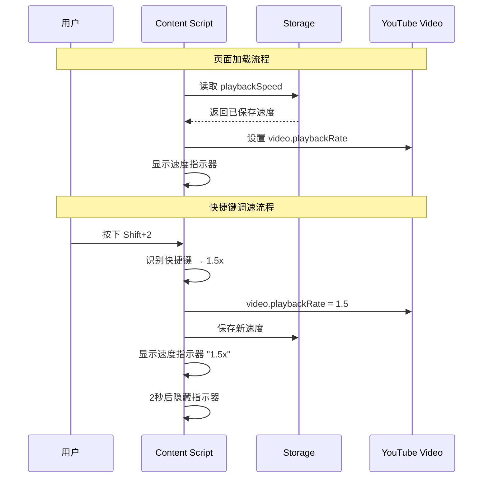
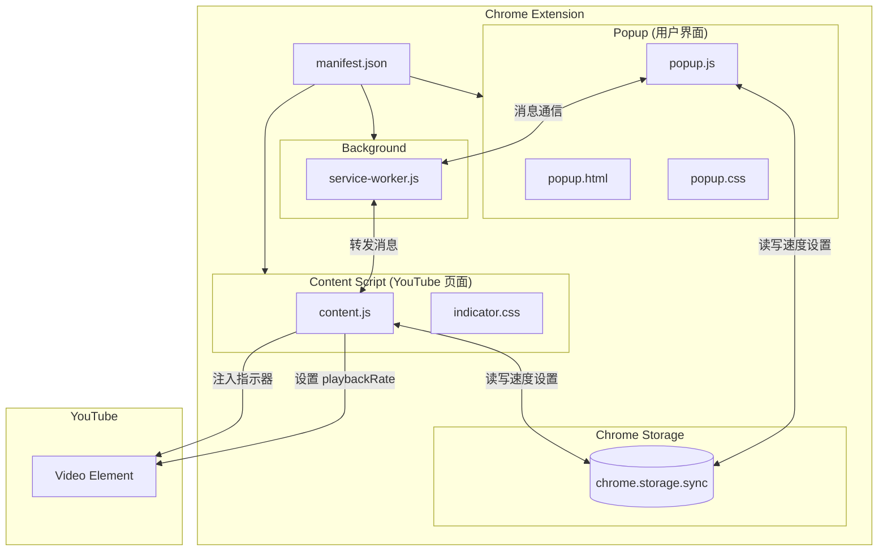

# YT Speed Control - 产品需求文档 (PRD)

> **版本**: v1.2 (微博支持)  
> **日期**: 2025-12-21  
> **状态**: ✅ 已发布

---

## 🎯 核心目标 (Mission)

> **让 YouTube 观看者通过直观的快捷键和优雅的 UI，精准掌控视频播放速度，打造个性化的观看节奏。**

---

## 👤 用户画像 (Persona)

| 属性 | 描述 |
|------|------|
| **目标用户** | YouTube 重度用户，包括学习型观众（看教程、公开课）、资讯消费者（看新闻、播客）、内容创作者（审片）|
| **核心痛点** | YouTube 原生速度控制需要多次点击菜单，效率低下；速度选项有限（最高2x）；切换视频后速度重置 |
| **期望** | 快捷键一键调速、突破原生速度限制、记住我的速度偏好 |

---

## ✅ V1: 最小可行产品 (MVP)

| 功能 | 说明 |
|------|------|
| **快捷键：预设速度** | `Shift+1` = 1x, `Shift+2` = 1.5x, `Shift+3` = 2x, `Shift+4` = 3x |
| **快捷键：微调速度** | `+` 加速 0.25x, `-` 减速 0.25x（范围 0.25x ~ 3x）|
| **速度悬浮指示器** | 调速时在**视频正中央**短暂显示当前速度徽章（2秒后淡出）|
| **Popup 控制面板** | 点击扩展图标显示：当前速度、速度滑块、预设按钮、快捷键说明 |
| **速度记忆** | 记住用户设置的速度，应用于所有 YouTube 视频（跨设备同步）|
| **鲁棒性设计** | 指示器自动检测 DOM 状态，YouTube 重绘后自动重建 |

---

## 📦 V2 及以后版本 (Future Releases)

| 版本 | 功能 |
|------|------|
| **V1.1** | ✅ 支持 Bilibili 平台（已完成）|
| **V1.2** | ✅ 支持微博视频平台（已完成）|
| **V2** | 自定义快捷键映射、为特定频道设置默认速度 |
| **V3** | 视频控制栏内嵌速度按钮、速度配置导入/导出 |
| **V4** | 支持其他视频平台（Vimeo, Twitch 等）|

---

## ⚙️ 关键业务逻辑 (Business Rules)

| 规则 | 描述 |
|------|------|
| **速度范围** | 最小 0.25x，最大 3.0x |
| **调节粒度** | `+/-` 每次调整 0.25x |
| **边界处理** | 达到边界时不再增/减，悬浮提示显示"已达最大/最小速度" |
| **记忆策略** | 使用 `chrome.storage.sync` 存储，跨设备同步 |
| **生效时机** | 页面加载后立即应用已保存的速度设置 |

---

## 📊 数据契约 (Data Contract)

### 存储数据结构 (chrome.storage.sync)

```javascript
{
  "playbackSpeed": 1.5,        // 当前/默认播放速度 (number)
  "showIndicator": true,       // 是否显示速度指示器 (boolean)
  "indicatorDuration": 2000    // 指示器显示时长 ms (number)
}
```

### 快捷键映射表

```javascript
{
  "Shift+1": 1.0,
  "Shift+2": 1.5,
  "Shift+3": 2.0,
  "Shift+4": 3.0,
  "+": "+0.25",
  "-": "-0.25"
}
```

---

## 🎨 MVP 原型设计 (选定方案 B: 玻璃拟态)

### 设计理念
> **现代、通透、有质感** - 采用毛玻璃效果 (Glassmorphism)，打造高级感的视觉体验

### 速度悬浮指示器

```
╭───────────────╮
│ ◉ ░░░░░░░░░░░ │   ← 毛玻璃背景 + 光晕动效
│    ✦ 2.0x ✦   │   ← 速度数值
│ ░░░░░░░░░░░ ◉ │   
╰───────────────╯
```

- 位置：**视频正中央**（无论窗口模式、剧场模式或全屏模式）
- 触发：任何速度变化时显示
- 动效：淡入 + 弹性放大 → 保持2秒 → 淡出缩小
- 样式：半透明毛玻璃背景，白色文字，柔和阴影，星光装饰

### Popup 控制面板

```
╭──────── Popup 控制面板 ────────╮
│ ░░░░░░░░░░░░░░░░░░░░░░░░░░░░░ │  ← 毛玻璃背景
│                               │
│   ⚡ YT Speed Control         │  ← 标题
│                               │
│   ╭─────────────────────╮     │
│   │                     │     │
│   │       1.5x          │     │  ← 大号速度显示
│   │                     │     │
│   ╰─────────────────────╯     │
│                               │
│   ◀━━━━━━━━━●━━━━━━━━━━▶      │  ← 渐变色滑块
│                               │
│   ╭───╮ ╭───╮ ╭───╮ ╭───╮    │
│   │1x │ │1.5│ │2x │ │3x │    │  ← 预设速度按钮
│   ╰───╯ ╰───╯ ╰───╯ ╰───╯    │
│                               │
│   ⌨️ Shift+1/2/3/4  +/-       │  ← 快捷键提示
│ ░░░░░░░░░░░░░░░░░░░░░░░░░░░░░ │
╰───────────────────────────────╯
```

### 设计规范

| 属性 | 值 |
|------|-----|
| **主色调** | 渐变紫蓝 `#667eea` → `#764ba2` |
| **背景** | `rgba(255, 255, 255, 0.15)` + `backdrop-filter: blur(10px)` |
| **圆角** | `16px` |
| **阴影** | `0 8px 32px rgba(0, 0, 0, 0.2)` |
| **字体** | Inter / -apple-system |
| **动效** | 所有过渡 `0.3s ease` |

---

## 🏗️ 架构设计蓝图

### 项目结构

```
YTSpeedControl/
├── manifest.json          # Chrome 扩展配置
├── popup/
│   ├── popup.html         # Popup 页面结构
│   ├── popup.css          # Popup 样式（玻璃拟态）
│   └── popup.js           # Popup 逻辑
├── content/
│   ├── content.js         # 内容脚本（注入 YouTube）
│   └── indicator.css      # 速度指示器样式
├── background/
│   └── service-worker.js  # 后台服务
├── icons/
│   ├── icon16.png
│   ├── icon48.png
│   └── icon128.png
└── Prd.md                 # 本文档
```

### 核心流程图



### 组件交互说明



### 文件职责说明

| 文件 | 职责 |
|------|------|
| `manifest.json` | 声明扩展权限、注入脚本、图标配置 |
| `popup.js` | 处理用户在 Popup 中的操作，更新存储 |
| `content.js` | 监听快捷键、控制视频速度、显示指示器 |
| `service-worker.js` | 处理 Popup 与 Content Script 间的消息通信 |
| `indicator.css` | 速度悬浮指示器的玻璃拟态样式 |

### 技术选型与风险

| 类别 | 选型 | 说明 |
|------|------|------|
| **存储方案** | `chrome.storage.sync` | 支持跨设备同步，配额 100KB 足够 |
| **样式注入** | CSS 文件注入 | 使用 `manifest.json` 的 `content_scripts.css` |
| **消息通信** | `chrome.runtime.sendMessage` | Popup ↔ Background ↔ Content |
| **动效实现** | CSS Transitions + Animation | 纯 CSS 实现，性能最优 |

#### 潜在风险

| 风险 | 影响 | 缓解措施 |
|------|------|----------|
| YouTube DOM 结构变化 | 指示器定位失效 | 使用相对定位于 video 元素，定期检测 |
| 快捷键冲突 | 与 YouTube 原生或其他扩展冲突 | 使用 `Shift+` 组合键减少冲突概率 |
| 视频动态加载 | SPA 页面切换时脚本未重新执行 | 监听 `yt-navigate-finish` 事件 |
| Manifest V3 限制 | Service Worker 生命周期短 | 仅用于消息转发，不存储状态 |

---

## ✅ 确认清单

- [x] 产品路线图已确认
- [x] MVP 功能范围已锁定
- [x] UI 设计方案已选定（方案 B: 玻璃拟态）
- [x] 架构设计已完成
- [x] PRD 文档已存档
- [x] **V1 开发已完成** ✨

---

## 🛠️ V1 实现记录

### 已解决的技术挑战

| 问题 | 解决方案 |
|------|----------|
| Shift+数字键被识别为符号 | 使用 `e.code` (物理按键代码) 替代 `e.key` |
| 指示器偶尔不显示 | 增加 `isConnected` 检查，自动重建 DOM 节点 |
| 非全屏模式定位偏移 | 使用 `video.closest()` 精准查找播放器容器 |
| 图标格式错误 | 强制转换为标准 PNG 格式 |

### 最终项目结构

```
YTSpeedControl/
├── manifest.json          # Chrome 扩展配置 (Manifest V3)
├── popup/
│   ├── popup.html         # Popup 页面结构
│   ├── popup.css          # Popup 样式（玻璃拟态）
│   └── popup.js           # Popup 逻辑
├── content/
│   ├── content.js         # 内容脚本（快捷键、指示器、速度控制）
│   └── indicator.css      # 速度指示器样式（玻璃拟态 + 动效）
├── background/
│   └── service-worker.js  # 后台服务（消息中转）
├── icons/
│   ├── icon16.png         # 16x16 PNG 图标
│   ├── icon48.png         # 48x48 PNG 图标
│   └── icon128.png        # 128x128 PNG 图标
└── Prd.md                 # 本文档
```

---

> 📌 **V1 已完成，可随时启动 V2 规划！**

---

## 🎉 V1.1 实现记录 - Bilibili 平台支持

### 新增功能

| 功能 | 说明 |
|------|------|
| **Bilibili 平台支持** | 扩展现已支持 Bilibili 视频网站 |
| **快捷键：预设速度** | `Shift+1` = 1x, `Shift+2` = 1.5x, `Shift+3` = 2x, `Shift+4` = 3x |
| **快捷键：微调速度** | `+` 加速 0.25x, `-` 减速 0.25x（范围 0.25x ~ 3x）|
| **速度悬浮指示器** | 调速时在视频正中央短暂显示当前速度徽章（2秒后淡出）|
| **速度记忆** | 与 YouTube 共享速度设置，跨平台同步 |

### 技术实现

#### 新增文件

```
YTSpeedControl/
├── content/
│   └── bilibili.js        # Bilibili 专用内容脚本
```

#### manifest.json 更新

- 添加 Bilibili 网站权限：`https://www.bilibili.com/*`, `https://bilibili.com/*`
- 添加 Bilibili content script 注入配置

#### Bilibili 快捷键映射

```javascript
{
  "Shift+1": 1.0,
  "Shift+2": 1.5,
  "Shift+3": 2.0,
  "Shift+4": 3.0,
  "+": "+0.25",
  "-": "-0.25"
}
```

### 技术挑战与解决方案

| 问题 | 解决方案 |
|------|----------|
| Bilibili 播放器 DOM 结构不同 | 使用多重选择器查找视频元素和播放器容器 |
| Bilibili SPA 导航检测 | 监听 URL 变化 + MutationObserver |
| 跨平台速度同步 | 使用 `chrome.storage.sync` 统一存储 |

### 开发日期

- **2025-12-20**: Bilibili 平台支持完成

---

> 📌 **V1.1 已完成，Bilibili 支持已上线！**

---

## 🎉 V1.2 实现记录 - 微博视频平台支持

### 新增功能

| 功能 | 说明 |
|------|------|
| **微博视频平台支持** | 扩展现已支持微博 (weibo.com) 视频 |
| **快捷键：预设速度** | `Shift+1` = 1x, `Shift+2` = 1.5x, `Shift+3` = 2x, `Shift+4` = 3x |
| **快捷键：微调速度** | `+` / `]` 加速 0.25x, `-` / `[` 减速 0.25x（范围 0.25x ~ 3x）|
| **速度悬浮指示器** | 调速时在视频正中央短暂显示当前速度徽章（2秒后淡出）|
| **速度记忆** | 与 YouTube、Bilibili 共享速度设置，跨平台同步 |
| **多播放器处理** | 智能识别页面上最大的可见视频作为控制目标 |

### 技术实现

#### 新增文件

```
YTSpeedControl/
├── content/
│   └── weibo.js           # 微博专用内容脚本
```

#### manifest.json 更新

- 添加微博网站权限：`https://weibo.com/*`, `https://www.weibo.com/*`
- 添加微博 content script 注入配置

#### 微博快捷键映射

```javascript
{
  "Shift+1": 1.0,
  "Shift+2": 1.5,
  "Shift+3": 2.0,
  "Shift+4": 3.0,
  "+": "+0.25",  // 或 ]
  "-": "-0.25"   // 或 [
}
```

### 技术挑战与解决方案

| 问题 | 解决方案 |
|------|----------|
| 微博页面存在多个视频元素 | 扫描所有视频元素，选择最大且可见的作为控制目标 |
| 微博播放器容器需要 position:relative | 动态检测并设置容器的 position 属性 |
| 指示器样式可能被微博 CSS 覆盖 | 使用内联样式 + `!important` 确保样式生效 |
| 微博 SPA 导航检测 | 监听 URL 变化 + MutationObserver |
| 跨平台速度同步 | 使用 `chrome.storage.sync` 统一存储 |

### 开发日期

- **2025-12-21**: 微博视频平台支持完成

---

> 📌 **V1.2 已完成，微博视频支持已上线！**
